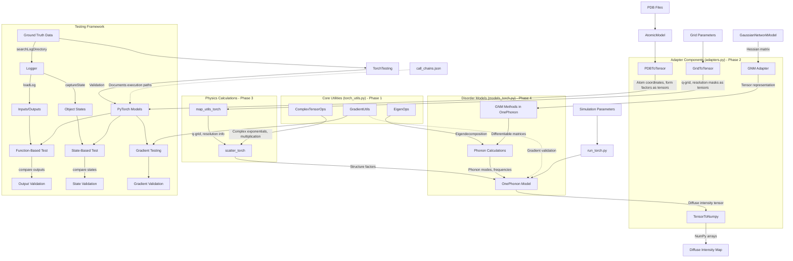

# PyTorch Port Architecture Overview

## Component-to-Function Mapping

This table explicitly maps architectural components to functions specified in `to_convert.json` with their execution paths documented in `call_chains.json`:

| Component | Functions | Source File | Implementation Phase | Call Path | Testing Approach |
|-----------|-----------|-------------|---------------------|-----------|------------------|
| **ComplexTensorOps** | N/A (utility) | N/A | Phase 1 | N/A | Function-based |
| **EigenOps** | N/A (utility) | N/A | Phase 1 | N/A | Function-based |
| **GradientUtils** | N/A (utility) | N/A | Phase 1 | N/A | Function-based |
| **map_utils_torch** | generate_grid | map_utils.py | Phase 3 | run_np() → OnePhonon.__init__() → self._setup() → generate_grid() | Function-based |
| **map_utils_torch** | compute_resolution | map_utils.py | Phase 3 | run_np() → OnePhonon.__init__() → self._setup() → get_resolution_mask() → compute_resolution() | Function-based |
| **map_utils_torch** | get_resolution_mask | map_utils.py | Phase 3 | run_np() → OnePhonon.__init__() → self._setup() → get_resolution_mask() | Function-based |
| **scatter_torch** | compute_form_factors | scatter.py | Phase 3 | run_np() → onephonon_np.apply_disorder() → structure_factors() → structure_factors_batch() → compute_form_factors() | Function-based |
| **scatter_torch** | structure_factors_batch | scatter.py | Phase 3 | run_np() → onephonon_np.apply_disorder() → structure_factors() → structure_factors_batch() | Function-based |
| **scatter_torch** | structure_factors | scatter.py | Phase 3 | run_np() → onephonon_np.apply_disorder() → structure_factors() | Function-based |
| **OnePhonon** | All OnePhonon methods | models.py | Phase 4 | Various paths as detailed in call_chains.json | State-based |
| **GaussianNetworkModel (partial)** | compute_hessian, compute_K, compute_Kinv | pdb.py | Phase 4 | Various paths as detailed in call_chains.json | State-based |
| **Adapters for AtomicModel** | _get_xyz_asus, flatten_model | pdb.py | Phase 2 | run_np() → OnePhonon.__init__() → self._setup() → Various paths | Function-based |
| **Adapters for Crystal** | get_asu_xyz | pdb.py | Phase 2 | run_np() → onephonon_np.apply_disorder() → Various indirect paths | Function-based |

## Adapter Usage Pattern

This project uses an adapter-based approach for bridging NumPy and PyTorch implementations. This approach was chosen to minimize code duplication while enabling gradient-based optimization.

### Import and Initialization Pattern

PyTorch implementation files import original NumPy classes directly:

```python
# In models_torch.py
from eryx.pdb import AtomicModel, Crystal, GaussianNetworkModel
```

But they use adapters to convert data between representations:

```python
# Adapter initialization
pdb_adapter = PDBToTensor(device=self.device)

# Convert NumPy model to PyTorch tensors
model_data = pdb_adapter.convert_atomic_model(atomic_model)
```

### Object State Management

For stateful objects like OnePhonon, we use dictionaries of tensor attributes rather than direct subclassing:

```python
class OnePhonon:
    def __init__(self, pdb_path, ..., device=None):
        # Initialize NumPy model for data loading
        np_model = AtomicModel(pdb_path, expand_p1)
        
        # Convert to tensor dictionary
        self.model_data = pdb_adapter.convert_atomic_model(np_model)
        
        # Access tensor attributes
        self.xyz = self.model_data['xyz']  # PyTorch tensor
```

### Method Call Patterns

Methods are reimplemented using PyTorch operations, but may use original method results for validation:

```python
def compute_resolution(cell: torch.Tensor, hkl: torch.Tensor) -> torch.Tensor:
    """PyTorch implementation of compute_resolution."""
    # Pure PyTorch implementation
    # ...
```

For complex stateful methods, we use state-based testing to ensure consistent behavior between implementations.

### Data Flow Across Component Boundaries

The following diagram illustrates how data flows between NumPy and PyTorch components through adapters:

```
NumPy Component → Adapter → PyTorch Component → Computation → Adapter → NumPy Result
```

Example:
```
AtomicModel → PDBToTensor → OnePhonon.__init__ → apply_disorder → TensorToNumpy → Visualization
```

## Component Interaction Diagram



## Component Descriptions

### Core Utilities (`torch_utils.py`) - Phase 1

#### ComplexTensorOps
- **Purpose**: Provides differentiable complex number operations for structure factor calculations
- **Key Methods**:
  - `complex_exp(phase)`: Computes e^(i*phase) returning (real, imaginary) parts
  - `complex_mul(a_real, a_imag, b_real, b_imag)`: Multiplies complex numbers preserving gradients
  - `complex_abs_squared(real, imag)`: Computes |z|² preserving gradients
  - `complex_exp_dwf(q_vec, u_vec)`: Computes Debye-Waller factor exp(-0.5*qUq)
- **Gradient Requirements**: All operations must support backpropagation
- **Tensor Shapes**:
  - `complex_exp`: Input (N,) → Output (N,), (N,)
  - `complex_mul`: Input (N,), (N,), (N,), (N,) → Output (N,), (N,)
  - `complex_abs_squared`: Input (N,), (N,) → Output (N,)
  - `complex_exp_dwf`: Input (N,3), (N,3) → Output (N,)

#### EigenOps
- **Purpose**: Provides differentiable eigendecomposition and related operations
- **Key Methods**:
  - `svd_decomposition(matrix)`: Computes SVD with gradient support
  - `eigen_decomposition(matrix)`: Computes eigenvalues/vectors with gradient support
  - `solve_linear_system(A, b)`: Solves Ax=b with gradient support
- **Used By**: Phonon calculations in OnePhonon model
- **Tensor Shapes**:
  - `svd_decomposition`: Input (N,M) → Output (N,K), (K,), (M,K)
  - `eigen_decomposition`: Input (N,N) → Output (N,), (N,N)
  - `solve_linear_system`: Input (N,N), (N,) → Output (N,)

#### GradientUtils
- **Purpose**: Validates gradients and provides gradient manipulation utilities
- **Key Methods**:
  - `finite_differences(func, input_tensor)`: Computes numerical gradients for validation
  - `validate_gradients(analytical_grad, numerical_grad)`: Compares analytical and numerical gradients
  - `gradient_norm(gradient)`: Computes L2 norm of gradients
- **Used By**: Testing framework for validating gradients

### Adapter Components (`adapters.py`) - Phase 2

#### PDBToTensor
- **Purpose**: Converts AtomicModel and related data to PyTorch tensors
- **Key Methods**:
  - `convert_atomic_model(model)`: Converts AtomicModel to tensor dictionary
  - `convert_crystal(crystal)`: Converts Crystal to tensor dictionary
  - `convert_gnm(gnm)`: Converts GaussianNetworkModel to tensor dictionary
- **Gradient Requirements**: Preserves structure for backpropagation
- **Maps to Functions**:
  - Handles AtomicModel._get_xyz_asus
  - Handles AtomicModel.flatten_model
  - Handles Crystal.get_asu_xyz
- **Call Paths**:
  - Used in execution path from run_np() → OnePhonon.__init__() → self._setup()
- **Example Usage**:
  ```python
  # Initialize adapter
  pdb_adapter = PDBToTensor(device=device)
  
  # Convert NumPy model
  model_data = pdb_adapter.convert_atomic_model(atomic_model)
  
  # Access converted data with gradient tracking
  xyz_tensor = model_data['xyz']  # PyTorch tensor
  ```

#### GridToTensor
- **Purpose**: Converts grid data and related structures to PyTorch tensors
- **Key Methods**:
  - `convert_grid(q_grid, map_shape)`: Converts q_grid to tensor
  - `convert_mask(mask)`: Converts boolean mask to tensor
- **Gradient Requirements**: Grid points need gradients, masks typically don't
- **Tensor Shapes**:
  - `convert_grid`: Input (N,3) → Output (N,3)
  - `convert_mask`: Input (N,) → Output (N,)
- **Call Paths**:
  - Used in execution path from run_np() → OnePhonon.__init__() → self._setup()
- **Example Usage**:
  ```python
  # Initialize adapter
  grid_adapter = GridToTensor(device=device)
  
  # Convert grid
  q_grid_tensor, map_shape = grid_adapter.convert_grid(q_grid, map_shape)
  
  # Convert mask
  mask_tensor = grid_adapter.convert_mask(mask)
  ```

#### TensorToNumpy
- **Purpose**: Converts PyTorch tensors back to NumPy arrays
- **Key Methods**:
  - `tensor_to_array(tensor)`: Converts tensor to array
  - `convert_intensity_map(intensity, map_shape)`: Converts intensity map to NumPy
- **Gradient Requirements**: N/A (one-way conversion)
- **Key Operations**:
  - Detach tensors from computational graph
  - Move tensors to CPU
  - Convert to NumPy arrays
- **Call Paths**:
  - Used after run_np() → onephonon_np.apply_disorder() to convert results
- **Example Usage**:
  ```python
  # Initialize adapter
  numpy_adapter = TensorToNumpy()
  
  # Convert tensor to array
  intensity_array = numpy_adapter.convert_intensity_map(intensity_tensor, map_shape)
  ```

#### ModelAdapters
- **Purpose**: Adapts between model representations
- **Key Methods**:
  - `adapt_one_phonon_inputs(np_model)`: Prepares inputs from NumPy OnePhonon
  - `adapt_one_phonon_outputs(torch_outputs)`: Converts PyTorch outputs to NumPy
  - `adapt_rigid_body_translations_inputs(np_model)`: Prepares inputs for other models
- **Example Usage**:
  ```python
  # Initialize adapter
  model_adapter = ModelAdapters(device=device)
  
  # Convert inputs
  torch_inputs = model_adapter.adapt_one_phonon_inputs(np_model)
  
  # Run PyTorch model
  torch_outputs = torch_model(**torch_inputs)
  
  # Convert outputs
  np_result = model_adapter.adapt_one_phonon_outputs(torch_outputs)
  ```

### Physics Calculations - Phase 3

#### map_utils_torch (`map_utils_torch.py`)
- **Purpose**: Provides grid generation and related utilities
- **Key Methods**:
  - `generate_grid(A_inv, hsampling, ksampling, lsampling)`: Creates q-grid tensor
  - `compute_resolution(cell, hkl)`: Computes resolution in Angstroms
  - `get_resolution_mask(cell, hkl_grid, res_limit)`: Creates resolution mask
- **Gradient Requirements**: Grid generation must preserve gradients
- **Tensor Shapes**:
  - `generate_grid`: Input (3,3), tuples → Output (N,3), tuple
  - `compute_resolution`: Input (6,), (N,3) → Output (N,)
  - `get_resolution_mask`: Input (6,), (N,3), float → Output (N,), (N,)
- **Call Paths**:
  - run_np() → OnePhonon.__init__() → self._setup() → generate_grid()
  - run_np() → OnePhonon.__init__() → self._setup() → get_resolution_mask() → compute_resolution()

#### scatter_torch (`scatter_torch.py`)
- **Purpose**: Provides structure factor calculations
- **Key Methods**:
  - `compute_form_factors(q_grid, ff_a, ff_b, ff_c)`: Computes atomic form factors
  - `structure_factors_batch(q_grid, xyz, ff_a, ff_b, ff_c)`: Batch structure factor calculation
  - `structure_factors(q_grid, xyz, ff_a, ff_b, ff_c)`: Overall structure factor calculation
- **Gradient Requirements**: Complex exponentials must preserve gradients
- **Tensor Shapes**:
  - `compute_form_factors`: Input (N,3), (M,4), (M,4), (M,) → Output (N,M)
  - `structure_factors_batch`: Input (N,3), (M,3), (M,4), (M,4), (M,) → Output (N,)
  - `structure_factors`: Input (N,3), (M,3), (M,4), (M,4), (M,) → Output (N,)
- **Call Paths**:
  - run_np() → onephonon_np.apply_disorder() → structure_factors() → structure_factors_batch() → compute_form_factors()
  - run_np() → onephonon_np.apply_disorder() → structure_factors() → structure_factors_batch()
  - run_np() → onephonon_np.apply_disorder() → structure_factors()

### OnePhonon Model (`models_torch.py`) - Phase 4

#### OnePhonon Class
- **Purpose**: Models diffuse scattering from phonons
- **Key Methods**:
  - `_build_A()`, `_build_M()`: Build displacement and mass matrices
  - `_build_M_allatoms()`, `_project_M()`: Mass matrix calculations
  - `_build_kvec_Brillouin()`: Computes k-vectors in Brillouin zone
  - `compute_gnm_phonons()`: Compute phonon modes
  - `compute_covariance_matrix()`: Compute covariance matrix
  - `apply_disorder()`: Apply disorder to get diffuse intensity
- **Gradient Requirements**: End-to-end gradient flow from parameters to intensity
- **Tensor Shapes** (key methods):
  - `apply_disorder`: Input parameters → Output (N,)
  - `compute_gnm_phonons`: No explicit input → Modifies self.V and self.Winv
  - `compute_covariance_matrix`: No explicit input → Modifies self.covar
- **Call Paths**:
  - run_np() → OnePhonon.__init__() → Multiple execution paths documented in call_chains.json
  - run_np() → onephonon_np.apply_disorder()
- **Adapter Usage**:
  ```python
  def __init__(self, pdb_path, ..., device=None):
      # Create NumPy model for data loading
      np_model = AtomicModel(pdb_path, expand_p1)
      
      # Convert using adapter
      pdb_adapter = PDBToTensor(device=device)
      self.model_data = pdb_adapter.convert_atomic_model(np_model)
      
      # Set attributes as tensors
      self.xyz = self.model_data['xyz']
      self.cell = self.model_data['cell']
  ```

#### GaussianNetworkModel Methods
- **Purpose**: Provides elastic network model functionality
- **Key Methods**:
  - `compute_hessian()`: Creates hessian matrix for elastic network
  - `compute_K(hessian, kvec)`: Computes dynamical matrix
  - `compute_Kinv(hessian, kvec)`: Computes inverse dynamical matrix
- **Gradient Requirements**: Matrix operations must preserve gradients
- **Implementation Approach**:
  - These methods are reimplemented in PyTorch using adapter-converted input data
  - They use tensor operations for differentiability
  - Non-differentiable parts like building neighbor lists remain in NumPy
- **Call Paths**:
  - run_np() → OnePhonon.__init__() → self._setup_phonons() → self.compute_gnm_phonons() → gnm.compute_hessian()
  - run_np() → OnePhonon.__init__() → self._setup_phonons() → self.compute_gnm_phonons() → gnm.compute_K()
  - run_np() → OnePhonon.__init__() → self._setup_phonons() → self.compute_covariance_matrix() → gnm.compute_Kinv()

## Device Management Strategy

### Device Selection
- All PyTorch components should accept an optional `device` parameter
- Default device should be determined using:
  ```python
  device = torch.device('cuda' if torch.cuda.is_available() else 'cpu')
  ```
- Device should be stored as an instance variable in classes
- Adapters should place tensors on the specified device when converting

### Device Handling at Component Boundaries
1. **Adapter Input Boundaries**:
   - PDBToTensor and GridToTensor should place tensors on the specified device
   - Example:
     ```python
     def array_to_tensor(self, array, requires_grad=True):
         tensor = torch.tensor(array, dtype=torch.float32, device=self.device)
         tensor.requires_grad_(requires_grad)
         return tensor
     ```

2. **Inter-Component Transfers**:
   - Components should ensure tensors are on the correct device before operations
   - Example:
     ```python
     def some_operation(self, input_tensor):
         input_tensor = input_tensor.to(self.device)
         # perform operations
         return result
     ```

3. **Output Boundaries**:
   - TensorToNumpy should handle device transfer back to CPU
   - Example:
     ```python
     def tensor_to_array(self, tensor):
         if tensor.requires_grad:
             tensor = tensor.detach()
         return tensor.cpu().numpy()
     ```

4. **Batch Processing**:
   - For large data processing, consider streaming batches to device
   - Example:
     ```python
     for batch in batches:
         batch_tensor = batch.to(device)
         # process batch
         result_list.append(result.cpu())  # Move result back to CPU if needed
     ```

## Tensor Shape Specifications

To ensure clear communication of tensor shapes at component boundaries, here are the detailed tensor shape specifications for key interfaces:

### PDBToTensor Output Shapes
- **atomic_positions**: (n_asu, n_atoms, 3)
- **form_factors_a**: (n_asu, n_atoms, 4)
- **form_factors_b**: (n_asu, n_atoms, 4)
- **form_factors_c**: (n_asu, n_atoms)
- **atomic_displacement**: (n_asu, n_atoms)

### GridToTensor Output Shapes
- **q_grid**: (n_points, 3)
- **resolution_mask**: (n_points,)
- **map_shape**: tuple of (dim_h, dim_k, dim_l)

### Structure Factor Calculation Shapes
- **Input**: 
  - q_grid: (n_points, 3)
  - xyz: (n_atoms, 3)
  - ff_a, ff_b: (n_atoms, 4)
  - ff_c: (n_atoms,)
- **Output**:
  - structure_factors: (n_points,) complex

### OnePhonon Key Tensor Shapes
- **Self.Amat**: (n_asu, n_atoms*3, 6)
- **Self.Linv**: (n_dof_per_cell, n_dof_per_cell)
- **Self.kvec**: (n_h, n_k, n_l, 3)
- **Self.V**: (n_h, n_k, n_l, n_dof_per_cell, n_dof_per_cell)
- **Self.Winv**: (n_h, n_k, n_l, n_dof_per_cell)
- **apply_disorder output**: (n_points,) or (dim_h, dim_k, dim_l)

## Key Data Flows

### 1. Data Initialization Flow
- **PDB Files → AtomicModel → PDBToTensor → PyTorch Models**
  - PDB files provide raw structural data
  - AtomicModel processes this into a structured object
  - PDBToTensor converts to differentiable tensor representation
  - PyTorch models receive tensor data with gradient capability
  - **Key Tensor Shapes**: (n_asu, n_atoms, 3) for coordinates

### 2. Grid Generation Flow
- **Grid Parameters → GridToTensor → map_utils_torch → Physics Calculations**
  - Grid parameters define the reciprocal space sampling
  - GridToTensor converts these to tensor representations
  - map_utils_torch generates differentiable q-grid tensors
  - Physics calculations use these for structure factor calculations
  - **Key Tensor Shapes**: (n_points, 3) for q-grid

### 3. Structure Factor Calculation Flow
- **Atomic Data + q-grid → ComplexTensorOps + scatter_torch → Structure Factors**
  - Atomic coordinates and form factors combine with q-grid
  - ComplexTensorOps provides differentiable complex number operations
  - scatter_torch computes structure factors with gradient preservation
  - Structure factors feed into OnePhonon model
  - **Key Tensor Shapes**: (n_points,) complex for structure factors

### 4. Phonon Calculation Flow
- **Matrix Construction → Phonon Calculations → OnePhonon Model**
  - A and M matrices constructed for projections
  - EigenOps performs differentiable eigendecomposition
  - Phonon calculations compute modes and frequencies
  - OnePhonon model uses these for diffuse scattering
  - **Key Tensor Shapes**: (n_h, n_k, n_l, n_dof, n_dof) for phonon modes

### 5. Diffuse Intensity Calculation Flow
- **Structure Factors + Phonon Modes → apply_disorder → Diffuse Intensity**
  - Structure factors provide atomic scattering
  - Phonon modes provide displacement correlations
  - apply_disorder combines these for diffuse intensity
  - TensorToNumpy converts results back to NumPy arrays
  - **Key Tensor Shapes**: (n_points,) for diffuse intensity

## Critical Differentiability Points

1. **Complex Operations in Structure Factors**
   - **Challenge**: Maintaining gradient flow through complex exponentials
   - **Solution**: Implement ComplexTensorOps with explicit real/imaginary parts 
   - **Components affected**: scatter_torch.py, structure_factors_batch
   - **Implementation approach**: Use separate real and imaginary tensors with PyTorch autograd

2. **Eigendecomposition in Phonon Calculations**
   - **Challenge**: PyTorch's eigendecomposition has limited gradient support
   - **Solution**: Use SVD-based approach with manual gradient implementation where needed
   - **Components affected**: OnePhonon.compute_gnm_phonons(), EigenOps
   - **Implementation approach**: Leverage torch.svd with careful handling of degenerate eigenvalues

3. **Adapter Conversions**
   - **Challenge**: Preserving gradient information during conversions
   - **Solution**: Careful design of adapter APIs to maintain computational graph
   - **Components affected**: All adapter classes in adapters.py
   - **Implementation approach**: Ensure tensor conversions retain requires_grad and device placement

4. **Batching and Memory Management**
   - **Challenge**: Handling large datasets while preserving gradient flow
   - **Solution**: Implement efficient batching strategy with gradient accumulation
   - **Components affected**: structure_factors(), OnePhonon.apply_disorder()
   - **Implementation approach**: Use torch.no_grad() strategically, accumulate gradients across batches

5. **State Initialization and Comparison**
   - **Challenge**: Maintaining gradient flow in state-based testing
   - **Solution**: Careful state restoration with gradient preservation
   - **Components affected**: OnePhonon and related classes, TorchTesting
   - **Implementation approach**: 
     - Initialize object state with gradient tracking enabled
     - Convert array attributes to tensors with requires_grad=True
     - Compare states with specific tolerances for numerical attributes
     - Trace gradients through the object state graph

## Testing Approaches

### Function-Based Testing
- Used for pure functions with well-defined inputs/outputs
- Loads function arguments and expected outputs from logs
- Executes PyTorch function with converted inputs
- Compares outputs within numerical tolerances

### State-Based Testing
- Used for methods that primarily mutate object state
- Loads object state before method execution
- Initializes PyTorch object with converted state
- Executes method under test
- Compares resulting state with expected state
- Verifies gradient flow through state changes

### Testing Framework Extensions

The testing framework is extended with:

1. **State Capturing**:
   - Method to capture complete object state
   - Serialization of complex nested structures
   - Filtering for reducing state size when needed

2. **State Restoration**:
   - Methods to initialize objects from serialized state
   - Conversion of NumPy arrays to PyTorch tensors
   - Proper gradient and device configuration

3. **State Comparison**:
   - Component-by-component state comparison
   - Tolerance-based comparison for numerical attributes
   - Detailed reporting of state differences
